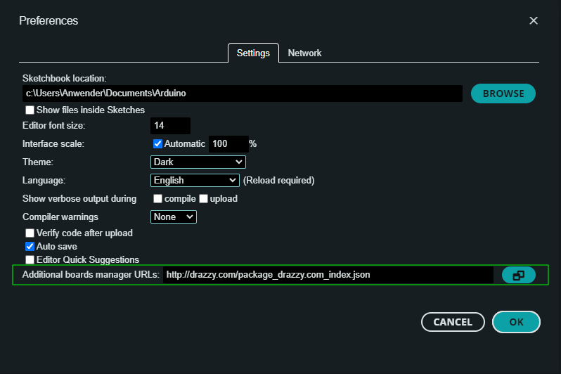

# HID-Button-ATTiny85

## Introduction
The HID-Button-ATTiny85 is based on the ATTiny85 board and acts as an automatic keyboard replacement which types credentials into a Windows (or similiar) login request with just a single button press.

## Hardware
- ATTiny85 USB or compatible like a DigiSpark USB (clone) with already installed _Micronucleus_ bootloader
- A regular pushbutton of your choice
- Circuit:  
- Wiring:  

## Manual / Remarks
- Install the USB drivers to be able to upload your sketches via USB
- Add in Arduino IDE preferences the Board Manager URL for ATTinyCore __http://drazzy.com/package_drazzy.com_index.json__ (see https://github.com/SpenceKonde/ATTinyCore for details):  
- Choose Board and Arduino IDE Settings as shown here:  
- Extract zip archive "Bounce2.zip" to C:\Users\<YOURUSERNAME>\AppData\Local\Arduino15\libraries
- Extract zip archive "DigisparkKeyboard-master-fixed.zip" to C:\Users\<YOURUSERNAME>\AppData\Local\Arduino15\libraries
- Extract the content of _DigisparkKeyboard-master-fixed.zip_ to __C:\Users\<YOURUSERNAME>\AppData\Local\Arduino15\libraries__ before compiling
- Before uploading the INO sketch to the board you must change in [Credentials.h](./Credentials.h) the login credentials USER|PASSWORD pairs to the desired real credentials
- If only a password input is needed leave the according USER value in [Credentials.h](./Credentials.h) empty
- __Optional:__ if a hardware reset is needed for your board you can connect _PB5_ with a pushbutton to _GND_ (but recommended is to use the builtin software reboot with button press)
- __Optional:__ you can upgrade the ATTiny85 bootloader with the _UpgradeBootloader.bat_ script within the [bootloader folder](./bootloader/)

## Usage
- Press the button shorter than 1 second to type credentials pair 1 as login
- Press the button between 1 and 5 seconds to type credentials pair 2 as login
- Press the button longer than 5 seconds to reboot the HID-Button

## Known Issues
- If the HID-Button-ATTiny85 is already plugged at start of the PC or during a restart it will not properly work, this issue #1 can be solved by replugging

## License / Copyright
The HID-Button-ATTiny85 is licensed under [GPL-2.0-only](./LICENSE).

© Alexander Feuster 2024
