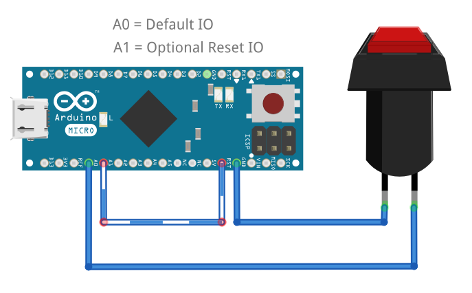

# HID-Button-Micro

## Introduction
The HID-Button-Micro is based on the Arduino Micro board and acts as an automatic keyboard replacement which types credentials into a Windows (or similiar) login request with just a single button press.

## Hardware
- Arduino Micro or compatible board
- A regular pushbutton of your choice
- Circuit:  
- Wiring:  

## Manual / Remarks
- It is recommended to usb a programmer to upload the sketch like the USBtinyISP or similiar
- Choose Board and Arduino IDE Settings as shown here (__optional:__ choose different programming or upload method):  
- Install the _Keyboard_ library via the Arduino IDE library manager:  
- Before uploading the INO sketch to the board you must change in [Credentials.h](./Credentials.h) the login credentials USER|PASSWORD pairs to the desired real credentials
- If only a password input is needed leave the according USER value in [Credentials.h](./Credentials.h) empty
- __Optional:__ if a 3rd USER|PASSWORD pair credential is needed the reboot function can be disabled by commenting out the according define in exchange to enable this

## Usage
- Press the button shorter than 1 second to type credentials pair 1 as login
- Press the button between 1 and 5 seconds to type credentials pair 2 as login  (default configuration)
- Press the button between 1 and 3 seconds to type credentials pair 2 as login  (alternative configuration)
- Press the button longer than 5 seconds to reboot the HID-Button               (default configuration)
- Press the button longer than 3 seconds to type credentials pair 3 as login    (alternative configuration)

## Known Issues
- none (as of date 09/2024)

## License / Copyright
The HID-Button-Micro is licensed under [GPL-2.0-only](./LICENSE).

© Alexander Feuster 2024
