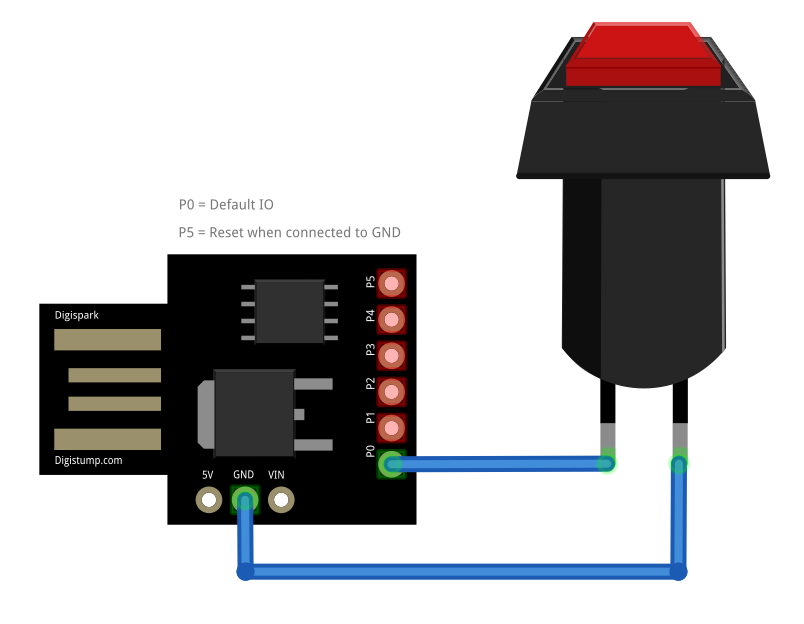

# HID-Button

## Introduction
The HID-Button acts as an automatic keyboard replacement which types credentials into a Windows (or similiar) login request with just a single button press.

## Hardware
- ATTiny85 USB or compatible like a DigiSpark USB (clone) with already installed _Micronucleus_ bootloader
- A regular pushbutton of your choice
- Circuit:  
- Wiring:  

## Manual / Remarks
- Install the USB drivers to be able to upload your sketches via USB
- Add in Arduino IDE preferences the Board Manager URL for ATTinyCore __http://drazzy.com/package_drazzy.com_index.json__ (see https://github.com/SpenceKonde/ATTinyCore for details):  
- Choose Board and Arduino IDE Settings as shown here:  
- Extract zip archive "Bounce2.zip" to C:\Users\<YOURUSERNAME>\AppData\Local\Arduino15\libraries
- Extract zip archive "DigisparkKeyboard-master-fixed.zip" to C:\Users\<YOURUSERNAME>\AppData\Local\Arduino15\libraries
- Extract the content of _DigisparkKeyboard-master-fixed.zip_ to __C:\Users\<YOURUSERNAME>\AppData\Local\Arduino15\libraries__ before compiling
- Before uploading the INO sketch to the board you must change in [HID-Button.ino](./HID-Button.ino) the login credentials USER|PASSWORD to the desired real credentials
- optional: if a reset is needed for your board you can connect _P05_ with a pushbutton to _GND_

## License / Copyright
The HID-Button is licensed under [GPL-2.0-only](./LICENSE).

© Alexander Feuster 2024
